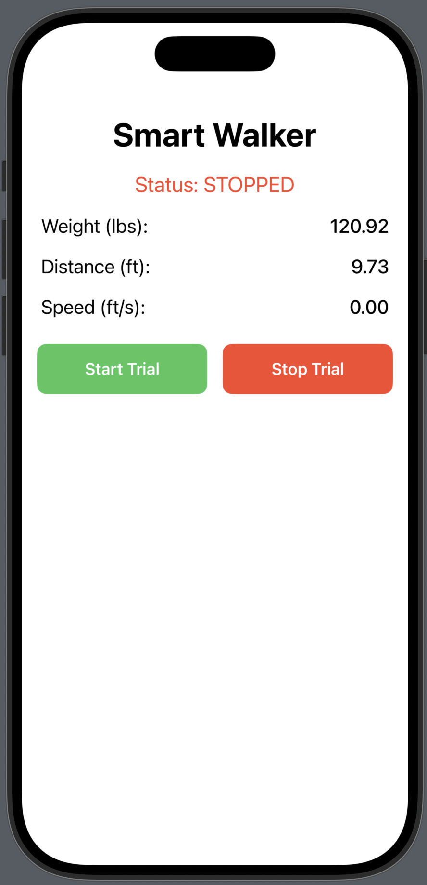

# Smart Walker

A SwiftUI app for the Spring 26 UW Madiosn BME Design [Smart Walker](https://bmedesign.engr.wisc.edu/projects/s26/smart_walker) project that displays live telemetry including weight, distance, and walking speed. 

The interface provides start/stop trial controls and currently uses simulated data to demonstrate the UI.

  
  

