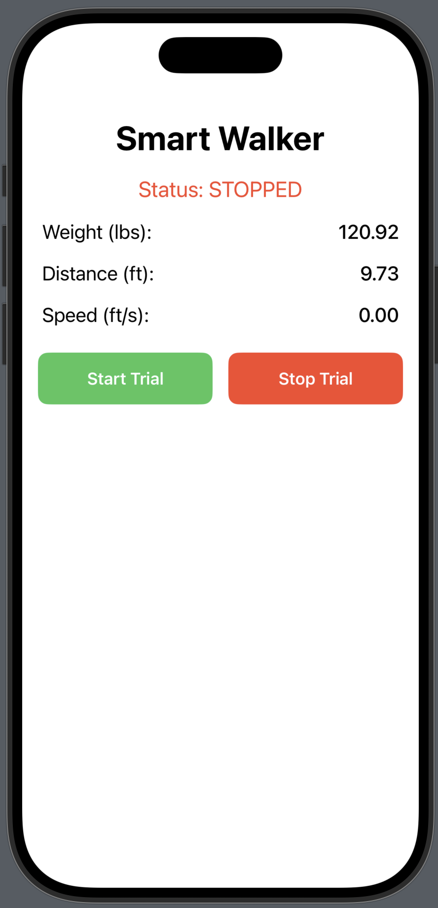

# Smart Walker

A SwiftUI + Arduino project for the Spring 2026 UW Madison BME Design [Smart Walker](https://bmedesign.engr.wisc.edu/projects/s26/smart_walker) project. The iOS app connects to three BLE-enabled Arduinos mounted on a walker to display live weight, distance, and walking speed data. Trials can be recorded per patient and exported as CSV.

<p align="left">
  
  
</p>

## Features

- **Live BLE Telemetry** — Real-time weight (left/right foot), distance traveled, and walking speed from 3 Arduino sensors
- **Patient Management** — Add patients via a popup picker; trials are organized per patient
- **Trial Recording** — One-tap start/stop with data captured at 200ms intervals
- **Trial History** — View past trials with summary stats (duration, distance, avg speed, avg weight)
- **CSV Export** — Share trial data as CSV via the iOS share sheet for further analysis
- **Auto-Connect & Reconnect** — BLE manager identifies Arduinos by name and reconnects automatically on disconnect
- **Data Persistence** — All patient and trial data saved to JSON, survives app restarts

## Project Structure

```
Smart Walker/
├── Arduino/
│   ├── swLeftFoot.ino          # ESP32 left foot load cell → BLE
│   ├── swRightFoot.ino         # ESP32 right foot load cell → BLE
│   └── swRadar.ino             # Uno R4 WiFi radar → BLE
│
├── Smart Walker/               # iOS app (SwiftUI)
│   ├── Smart_WalkerApp.swift   # App entry point, injects dependencies
│   ├── ContentView.swift       # Main dashboard (telemetry, trials, patient selector)
│   ├── PatientPickerSheet.swift# Patient selection popup sheet
│   ├── TrialDetailView.swift   # Trial summary + CSV export
│   ├── BluetoothManager.swift  # CoreBluetooth multi-connection manager
│   ├── DataStore.swift         # Patient/trial persistence (JSON)
│   ├── Info.plist              # Bluetooth permission
│   └── Models/
│       ├── Patient.swift       # Patient data model
│       └── Trial.swift         # Trial + DataPoint models, CSV export
│
└── references/                 # Datasheets and links
```
