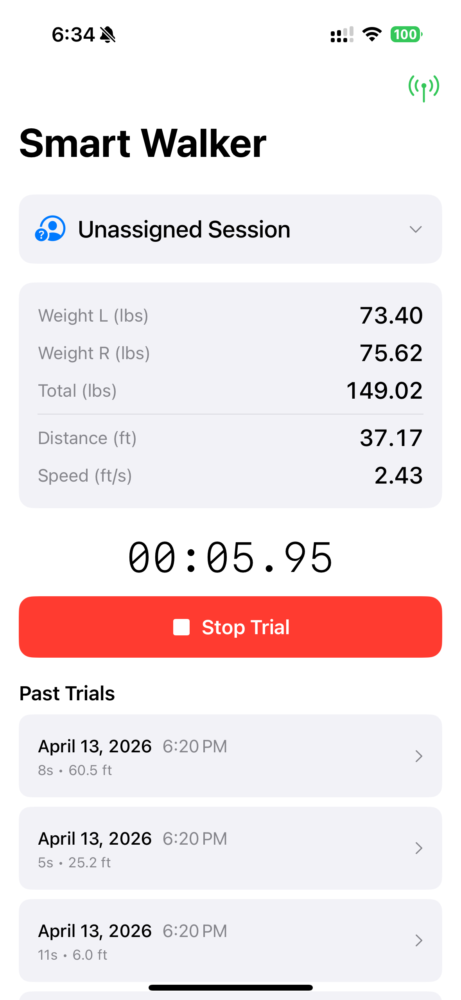
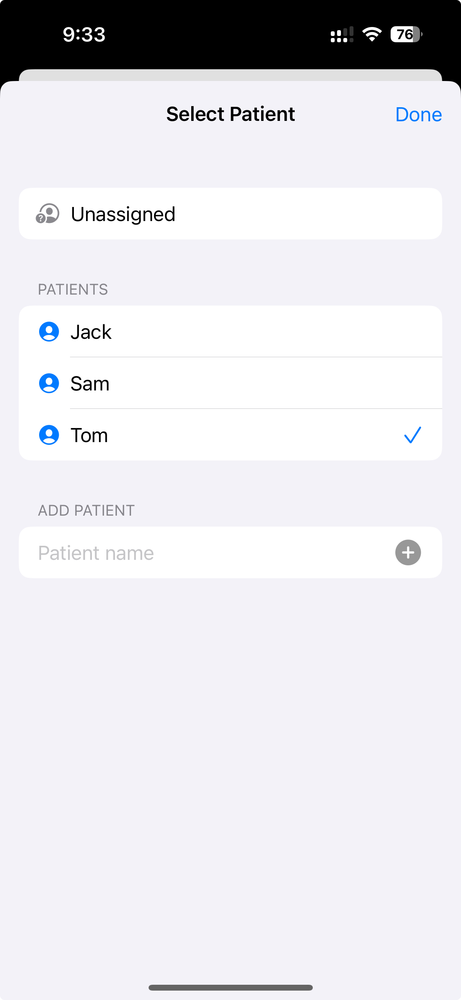
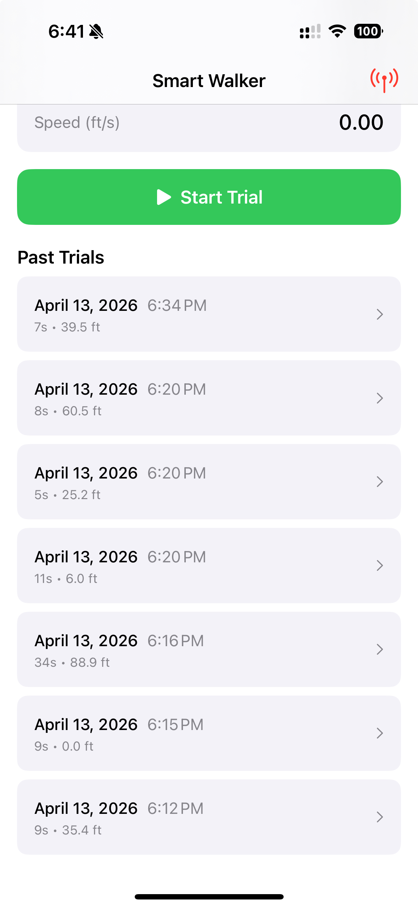
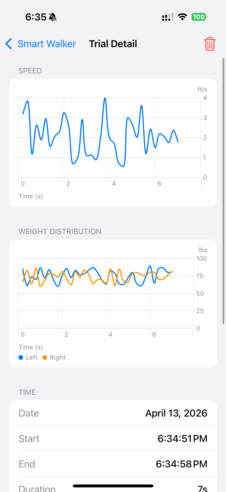
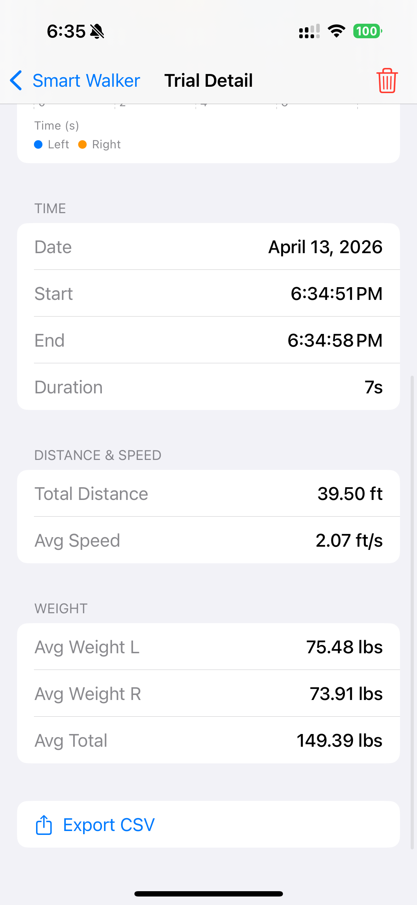
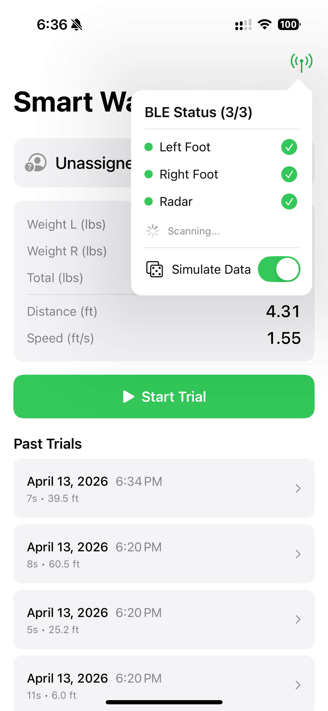
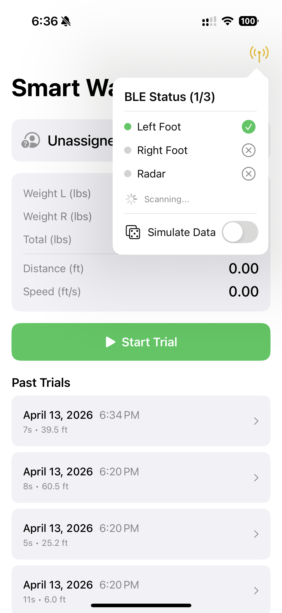
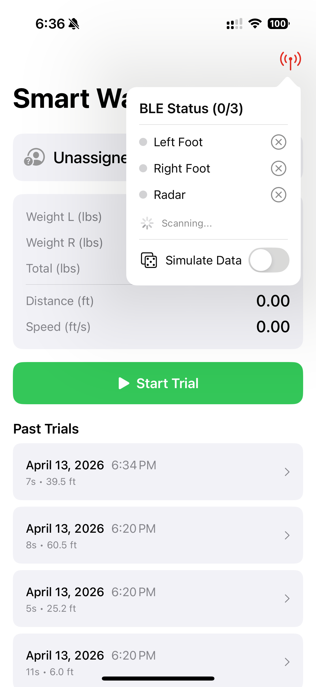

# Smart Walker

A SwiftUI + Arduino project for the Spring 2026 UW Madison BME Design [Smart Walker](https://bmedesign.engr.wisc.edu/projects/s26/smart_walker) project. The iOS app connects to three BLE-enabled Arduinos mounted on a walker to display live weight, distance, and walking speed data. Trials can be recorded per patient and exported as CSV.

## Features

### Live BLE Telemetry
- Real-time weight (left/right foot), distance traveled, and walking speed from 3 Arduino sensors
- One-tap start/stop with data captured at 200ms intervals
- Live elapsed timer (MM:SS.cc) during trial recording
<p align="left">
  
  
</p>

### Patient Management
Add patients via a popup picker; trials are organized per patient
<p align="left">
  
</p>

### Trial History
- View past trials with summary stats (duration, distance, avg speed, avg weight)
- Speed chart — line chart showing walking speed over time
- Weight distribution chart — dual-line chart (left/right foot pressure) over time
- Delete trials from the detail page (trash icon with confirmation)
- Share trial data as CSV via the iOS share sheet for further analysis
- All patient and trial data saved to JSON, survives app restarts
<p align="left">
  
  
  
</p>

### Auto-Connect & Reconnect
- BLE manager identifies Arduinos by name and reconnects automatically on disconnect
- Intuitive BLE connection status indicator
- Simulation mode — toggle simulated sensor data for testing without hardware
<p align="left">
  
  
  
</p>

## Project Structure

```
Smart Walker/
├── Arduino/
│   ├── swLeftFoot.ino          # ESP32 left foot load cell → BLE
│   ├── swRightFoot.ino         # ESP32 right foot load cell → BLE
│   └── swRadar.ino             # ESP32 Ti AWR1843Boost mmWave radar → BLE (data UART only, config hardcoded in sensor)
│
└── Smart Walker/               # iOS app (SwiftUI)
    ├── Smart_WalkerApp.swift   # App entry point, injects dependencies
    ├── ContentView.swift       # Main dashboard (telemetry, trials, patient selector)
    ├── PatientPickerSheet.swift# Patient selection popup sheet
    ├── TrialDetailView.swift   # Trial summary, charts, CSV export
    ├── BluetoothManager.swift  # CoreBluetooth multi-connection manager
    ├── DataStore.swift         # Patient/trial persistence (JSON)
    └── Models/
        ├── Patient.swift       # Patient data model
        └── Trial.swift         # Trial + DataPoint models, CSV export
```
